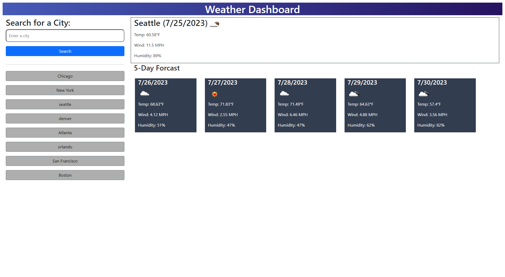

# Mod-6-Weather-App

## Description

A weather application that starts by gathering the users current location and shows the current weather and a 5-day forcast.  The user can then enter a city in the search and find the current weather and a 5-day forcast for that location.  Their entries are saved with up to 8 prior search entries. The search and default location show temperatures, wind speed, humidity, and an icon showing the weather conditions. 

## Installation

N/A - Project is deployed to https://tannernd.github.io/Mod-6-Weather-App/

## Usage

The following image shows the web application's appearance and functionality:

## Credits

N/A

## License

N/A
